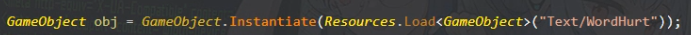
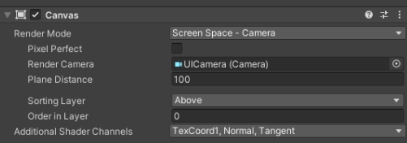
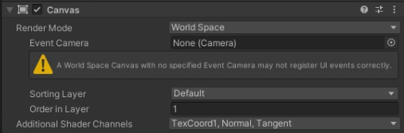
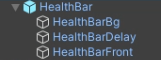
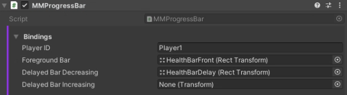
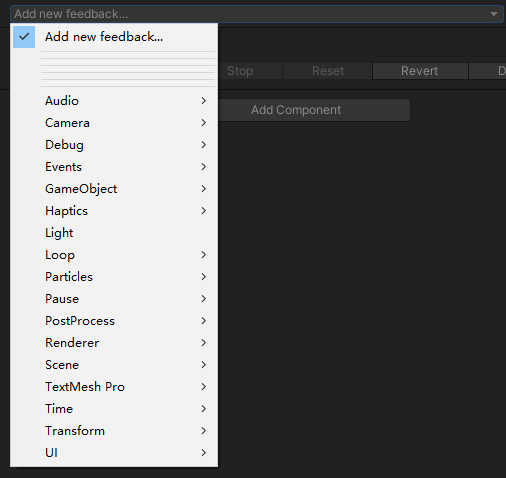
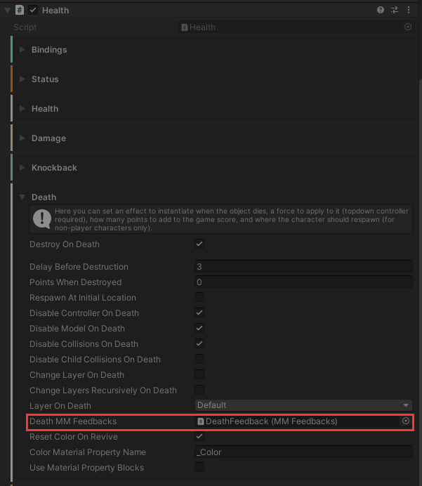

##基于UnityTopDownEngine开发Roguelike游戏Demo

[TOC]

###游戏设计
####游戏循环
- 开始界面
- 选角界面（可选，可以考虑做多职业）
- 关卡循环
	- 准备阶段，选择武器（第一关，选择武器，后续关卡随机刷新能力或武器）
	- 战斗阶段
- 游戏通关/失败 界面

####游戏玩法
1. 主角可携带两把武器 （武器应有互补性，这样玩家才有更好武器的理由）
2. 武器分为近战和远程
3. 击杀怪物获得金币，金币用于购买武器或能力，还可以用于刷新商店
4. 击杀怪物获得经验，玩家升级后自动打开商店，可以免费选择一次奖励

####游戏数值
#####基础属性
- 生命，伤害，攻击速度，移动速度，暴击率

##### 玩法数值
- 经验值， 金币

#####品质
品质分为 白，绿，蓝，紫，红
武器品质：品质主要影响武器攻击力，品质高的武器还会获得随机词条（暂定，白绿1，蓝紫2，红3）

#####<s>武器词条
- 基础词条：一般是加基础属性
- 武器特有词条：武器专属，一般显著提升武器强度，或是改变武器特性
- 词条品质分为 白，蓝，红，低品质武器无法刷出高品质词条，反过来则可以
- 词条浮动：词条增加的属性不是固定的会有浮动
- 举例，攻击力：白 1~5%，蓝 5%~15%，红15%~30%

#####武器种类
| 名称 | 攻击力 | 攻速 | 弹夹 | 换弹时间 |
| ----------- | ------------ | ------ |
| 手枪 | 1 | 0.5s | 12 | 2s |
| 左轮手枪 | 5 | 1s | 6 | 5s |
| 棒球棍 | 5 | 1s |

#####怪物种类
| 名称 | 生命 | 攻击力 | 移动速度 |
| ----------- | ------------ |
| 喽啰1 | 低 | 低 | 中等 |


### 小知识
#### TextMeshPro
- 字体创建
https://blog.csdn.net/weixin_44870508/article/details/122176168
- 富文本
https://blog.csdn.net/qq_28112287/article/details/78320384
- ToString("#0.00") 保留小数点后两位 

####TileMap
- Rule Tile
https://blog.csdn.net/weixin_62953519/article/details/124623934

#### DoTween
- Transform.DoMove(target, time) 
	- 花费时间time, 从当前位置差值移动到目标位置

-  Tween 回调
	- 例子：Transform.DoMove().onComplete = delegate() {}
	- onComplete 执行结束后调用
	
#### Unity像素画模糊，失真解决办法
https://www.bilibili.com/read/cv11942426/
	- 过滤方式改成Point(filter)
	- Compression改成None

#### Odin Inspector


### 大坑
#### 无法赋值场景中的对象给预制体参数
- 问题
	- 前提条件：使用资源加载的方法实例化对象
		- 
	- 从预制体实例化对象后，inspector中赋值的参数丢失
		- 预制体编辑的时候是选不了场景中的对象（可能unity已经提示我们不能提前赋值）
		- 选择不了场景中的对象，只好赋值另一个预制体
		- 
		- 

- 解决方法
	实例化对象后在脚本中赋值

### Top Down Engine笔记
#####Managers
- GameManager
	- 负责处理游戏的分数和时间
	- 游戏帧数
	- 玩家当前和最大复活次数
	- 定义`TopDownEngineEvent`和`TopDownEnginePointEvent`的地方
	- 游戏暂停和恢复
	- 游戏分数记录
- SoundManager
	- 一个简单但功能强大的声音管理器，可以让您以基于事件的方式播放声音，并且性能不错

- LevelManager
 - 玩家创建，重生
 - 出生点，存档点管理
 - 场景淡入淡出控制
- MMTimeManager
 - 可以通过MMFreezeFrameEvents和MMTimeScaleEvents使时间停顿下来
 - 可以用于实现子弹时间等等
- Inventory
	- 背包系统，增加，删除，装备物品
	- 保存加载数据
-  AchievementRules
	-  成就系统

#####Cameras
- MainCamare
	- 主摄像机
	- 主要挂载了一些基础的组件
	- AudioListener 声音接收组件
	- Post-process Layer 后处理层级
	- MM Audio Listener 确保只存在一个AudioListener，避免抛出警告
-  Chinemachine Camera
	-  功能强大的相机跟随组件
	-  无需手动设置跟随的对象，通过Chinemachine Camera Controller 脚本控制
	-  MMCinemachineCameraShaker 相机抖动脚本
- UICamera
	- 用于渲染UI专用的摄像机
	- 基础设置
		- Clear Flags = Death Only
		- Culling Mask = UI
		- Death 的值要比MainCamera大
	- UI附加到UICamera下
	-  GUIManager
		-  处理GUI特效和更新
		-  HUD 挂载了头像，血量条，分数等等的对象，用于统一管理显示和隐藏
	-  InputManager
		-  输入管理
		-  PlayerID 要与Character的对应
	-  PostProcessVolume 后期处理体积
		-  MMChromaticAberrationShaker 将这个脚本添加到具有色差后处理的Camera中，它将能够通过获取事件来“动摇”其值
		
#####Character
```
├── CharacterGameObject
|	|	Character
|	|	TopDown Controller 2D
|	|	Character XX (Abilitys)
|	|	Health
|	├── Model (2D)
|	|	└── SpriteRenderer
|	└── WeaponAttachment (Transform)
```

- 这个类将引导角色的TopDownController组件
- 在这里你将执行所有角色的游戏规则，如跳跃，冲刺，射击等
- CharacterAbility的载体，在这里获取各个参数并传递到Ability，并在每帧驱动Ability
	- Character
	- 可以点击AutoBuild Player Chatacter 2/3D 构建玩家基础组件
	- CharacterModel 要绑定玩家模型
	- 包含两个状态机 MovementState 和 ConditionState
	- EveryFrame
		- 每帧除了处理能力组件外，还更新动画参数
		- EarlyProcessAbilities		
		- ProcessAbilities
		-  LateProcessAbilities
		-   UpdateAnimations
	-  MMAnimatorExtensions
		-  传统方法Animator.SetXX(string name, value) 通过字符串更新，效率低
		-  需要在初始化时调用AddAnimatorParameterIfExists计算参数名的Hash值，后续通过Hash值更新动画参数
		-  UpdateAnimatorXX 更新动画参数
		
##### TopDown Controller 2D
- 俯视角视图中控制rigidbody2D和collider2D移动的控制器
- 在FixelUpdate中根据CurrentMovement更新rigidbody的位置，CurrentMovement在CharacterMovementAbility中修改
- Grounded 是否在地面
- OverHole 是否在洞穴上面
- 2D 跳跃中角色还是在原地，只是播放了跳跃动画

#####CharacterAbility
- 官方原文简介：角色能力是使角色能够执行动作的脚本。无论是跳跃、跑步还是按下按钮，都是如此。拥有这些独立的能力脚本将允许实现最佳架构。这也会让你更容易创造自己的能力
- CharacterAbility
	- AbilityPermitted 能力是否解锁，默认为true
	- AbilityAuthorized属性，判断能力是否被阻塞，阻塞返回false否则返回AbilityPermitted，处理能力前应该判断
	- RegisterAnimatorParameter 类似MMAnimatorExtensions，可以生成动画参数名的Hash值
	- MMCooldown
		- 技能冷却
		- MMCooldown.Ready 技能是否就绪
		- MMCooldown.Start 使用能力时调用
		- MMCooldown.Update 在ProcessAbility中调用
- CharacterMovement
	- 基础移动能力
	- 可以设置行走速度
	- 可配置空闲阀值
	- 移动方向可以是 2/4/8 或任意方向
- CharacterRun
	- 可以设置跑步速度
- CharacterOrientation 2D
	- 旋转或翻转角色朝向移动、武器方向或两者
- CharacterButtonActivation
	- 这个组件允许角色与按钮驱动的对象（对话区、开关…）交互
- CharacterPause
	- 暂停游戏
- CharacterTimeControl
	- 修改游戏时间速率 
- CharacterHandleWeapon
	- 使用武器
- CharacterInventory
	- 绑定背包，使用背包系统

##### Health & Damage
- Health
	- 该类管理对象的健康状况，引导其潜在的健康条，处理对象受到损害时发生的情况，和它死后会发生什么
	- 可配置当前血量，最大血量
	- 接受伤害，受伤免疫控制，角色受伤反馈
	- 击退免疫控制，击退强度加成
	- 死亡控制，死亡反馈
- DamageOnTouch
	- 将此组件添加到物体上，它将对与之碰撞的物体造成伤害
	- 可以配置碰撞目标的LayerMask，可以配置滤碰撞方式OnTriggerEnter或OnTriggerStay或两者都是
	- DamageCause
		- 伤害设置，伤害 = Random.Range(最小伤害，最大伤害)
		- 击退，击退强度
	- DamageTaken
		- 在对它碰撞的物体施加伤害后，你可以让这个物体伤害自己，这个对象需要Health组件
		- 可以定义它每次击中目标时自身所受的伤害，或者只在击中可破坏或不可破坏的物体时才会受到伤害
		- 自身击退，击退强度
		- 例如：设计一种可以穿透敌人的子弹，给子弹添加Health组件并设置血量，通过控制损害和血量控制可以穿过敌人数量
- HealthBar
	- 玩家血条
		-  


		- 在HUD下创建空物体，添加MMProgressBar脚本
		- 添加三个子物体（Image），分别作为血条的背景，延迟血条，血条
		- 绑定血条图片绑定到MMProgressBar脚本
		- 把血条对象添加到GUIManager的HealthBars列表
	- 头顶血条

##### DamageType
- 可以参考Demo KoalaHealth查看怎么实现
- 伤害类型
	- TopDownEngine提供的类型有四种，灼烧，冰冻，中毒，减速
- DamageResistanceProcessor
	- DamageResistance管理类，存储DamageResistance的列表，需要赋值到Health组件中才能生效
	- 受到伤害时，遍历列表处理伤害附加和特定伤害类型的表现
	- 获取某种类型是否免疫状态，移动速度变化
- DamageResistance
	- 特定伤害类型处理类，可以实现以下效果
		1. 伤害增加/减少(可以理解为针对特定类型(DamageType)增加伤害或伤害抵抗)
		2. 通关反馈处理受到某种类型伤害时的表现，例如：
			- 播放粒子效果：灼烧时角色身上带火
			- 激活指定对象：角色冰冻时激活角色的子对象，一个冰冻的角色形象
	- 免疫
		- DamageType设置为对应的类型
		- DamageMulti = 0，免疫伤害
		- PreventCharacterConditionChange = true， 免疫状态变化 
		- PreventMovementModifier = true， 免疫移动速度变化 
- 免疫获取（通过拾取道具）
	- PickableDamageResistance的Create模式
		- 当拾取物品时，创建新对象作为拾取人的子对象，并拷贝免疫组件到该对象
		- DamageResistanceToGive，存放免疫组件的对象
	- PickableDamageResistance的ActivateByLabel和DisableByLabel模式
		- 免疫组件事先添加到角色身上，通过DamageResistance的Lable字段，激活或禁用免疫组件
		- 例如中毒免疫
			- 角色身上已经拥有两个组件PoisonResistance和SuperPosionResistance(初始是未激活状态)
			- 免疫时PoisonResistance(未激活)	SuperPosionResistance(激活)
			- PoisonResistance的作用是通过反馈处理中毒后的视觉表现(持续扣血效果是通过DamageOnTouch的OverTimeDamage实现，并没有角色改变状态)
			- SuperPosionResistance的作用是免疫中毒伤害
	- TypeDamage 状态附加
		- DamageOnTouch的TypeDamages列表中添加触发时附加的状态
		- ForceCharacterCondition 改变角色状态
		- ApplyMovementMultipiler 改变移动速度

#####InputManager
- 这个持久的单例处理输入并向玩家发送命令
- 脚本执行循序 -100， https://docs.unity.cn/cn/current/Manual/class-MonoManager.html
- 可设置移动控制方式 Joystick 或 Arrows
- 初始按钮，添加按钮IMButton对象到ButtonList
	- ButtonList.Add(new MMInput.IMButton (PlayerID, "Jump"，down_delegate,  pressed_delegate, up_delegate))
	- 可以传入委托函数进行回调，默认是行为是直接修改按钮的状态
- 初始化轴
	- 根据PlayerId计算轴名称，通关Input.GetAxis或GetAxisRaw获取轴输入
- MMInput
	- 输入辅助类，有Button和Axis输入两种
	- ButtonStates
		- Off 未激活
		- ButtonDown 按下那帧
		- ButtonPressed 按住
		- ButtonUp 抬起那帧
	- IMButton
		- 一个用于处理按钮状态的类，无论是移动键还是实际键
		- 内部由一个状态机实现，MMStateMachine<MMInput.ButtonStates>
		- ButtonID = PlayerID + "_" + name, 例如: Player1_Jump
	- ProcessAxisAsButton
		- 轴按钮，保存的值是一个ButtonStates，通过这个方法计算当前按钮状态

##### Inventroy 背包


#####AI
```
├── AICharacterGameObject
|	├──	AIActions
|	├── AIDecisions
|	├── AIBrain
|	|	└── States
|	|		├── AIActions (reference)
|	|		└── AITransitions 
|	|			└── AIDecisions (reference)
```
- AIState
	- 状态是一个或多个AIAction和一个或多个AITransition的组合
- AIAction
	- 动作是行为，描述你的角色在做什么 
	- 例如：巡逻，射击，跳跃等
	- 这个引擎附带了许多预定义的动作，并且很容易创建自己的动作
- AIDecision：
	- 决策是每帧将转换进行评估的组件，并将返回true或false
	- 例如：包括在一种状态下花费的时间，到目标的距离，或在一个区域内的对象检测
- AITransition : 
	- AITransition是一个或多个决策和目标状态的组合，无论这些转换是真是假
- AIBrain : 
	- AIBrain 负责根据定义的AITransition从一种状态转换到另一种状态
	- 它基本上只是状态的集合，在这里你将把所有的AIAction、AIDecision、AIState和AITransition链接在一起


##### MMSingleton 单例类
namespace MoreMountains.Tools
- 使用方法
	```
	//定义类时继承MMSingleton
	public class ClassName : MMSingleton<ClassName>
	//调用
	ClassName.Instance.FunName()
	```
- 当调用Instance获取单例对象时，如果对象还没创建会自动创建对象

##### MMEvent
namespace MoreMountains.Tools
- MMEvent
	- 自定义事件，是一个结构体（可参考TopDownEngineEvent）
	- 通过这个结构体把事件触发时的信息传递给监听者，这个类型和MMEventListener监听的类型对应

- MMEventManager
	- 事件管理器（静态类）
	- 内部使用字典储存类型到事件监听类列表的映射
	- AddListener 添加监听
	- RemoveListener 删除监听
	- TriggerEvent 触发事件
	
- EventRegister
	- 事件注册类
	- 提供两个方法`MMEventStartListening` `MMEventStopListening`方便添加和删除监听
	- 使用方法
		```
		// 由于这两个方法的参数是传入this, 可以这样调用 (前提是该类继承了MMEventListener接口)
		this.MMEventStartListening<MMEvent>()
		this.MMEventStopListening<MMEvent>()
		```

- MMEventListener<MMEvent>
	- 事件监听接口
	- 在需要监听事件的类继承并实现这个方法
	- 提供OnMMEvent方法，触发事件时在MMEventManager中会调用
	- 使用方法
	```
	//定义类时继承MMEventListener<MMEvent>
	public class ClassName : MMEventListener<MMEvent>
	//实现OnMMevent
  public void OnMMEvent(MMEvent e)
	```

#### MMF_Feedback
- 反馈系统，更像是一组预定义好的事件，方便实现各种需要的效果，例如：
	- 怪物死亡时播放特效，声音
	- 玩家受到伤害画面变现等等
- 使用方法
	- 在需使用反馈的对象添加子物体命名为NameMMFeedback, 名字最好能明确表达用途，例如DamageFeedback, DeathFeedback
	- 添加MMFeedback组件，然后点击Add new feedback添加需要的反馈
	- 
	- 最后把这个子对象添加到触发反馈的地方，TopDownEngine提供了大量预定义好触发MMFeedback的地方，例如：
		- Health组件的Death选项下可以配置挂载了Health的对象死亡时触发的反馈
		- 
- 自定义反馈
	- 什么时候应该自定义反馈
		- 当现有的反馈无法满足我们的需求时可以自定定义新的反馈
		- 其实反馈中已经包含了一个MMGameEvent，触发反馈时会发送一个字符串的事件(MMEvent)，基本上很多游戏事件都可以通过一个字符串告诉监听者触发事件时的信息（简单的非频繁触发的事件可以使用）
		- 但是某些事件还是独立出来更好，一方面是性能问题，另一方面是为了后面更好维护
			- 例如怪物掉落事件，这个事件可能会频繁触发，如果使用MMGameEvent，同一个频道的监听者就会收到大量垃圾信息，导致性能降低
	- 自定义反馈继承MMF_Feedback，可以参考MMF_MMGameEvent.cs的实现
		- 实现方法CustomPlayFeedback，实现反馈触发时发生的事情
		```
		protected override void CustomPlayFeedback(Vector3 position, float feedbacksIntensity = 1.0f)
		{
			if (!Active || !FeedbackTypeAuthorized) //判断是否符合触发条件
			{
				return;
			}
			// do someing
		}
		```

##### MMAttribute
- MMCondition(string name, bool cond)
	- 根据name指定的变量的值，控制变量在Inspector是否可编辑，是否隐藏
	- 变量值为true时正常显示，为false不可编辑，cond控制不可编辑时是否隐藏
- MMEnumCondition(string name, (int)enum)
	- 根据name指定的枚举变量的值，控制变量在Inspector是否隐藏
	- 枚举变量需要强转类型到int
- MMInspectorGroup
	- Inspector面板变量分组
- MMVector(string[] names)
	- 可以标注Vector2，Vector3变量的注释，默认是X，Y，Z
- MMInformation(string msg, InformationType type, bool messageAfterProperty)
	- 在Inspector面板显示信息
